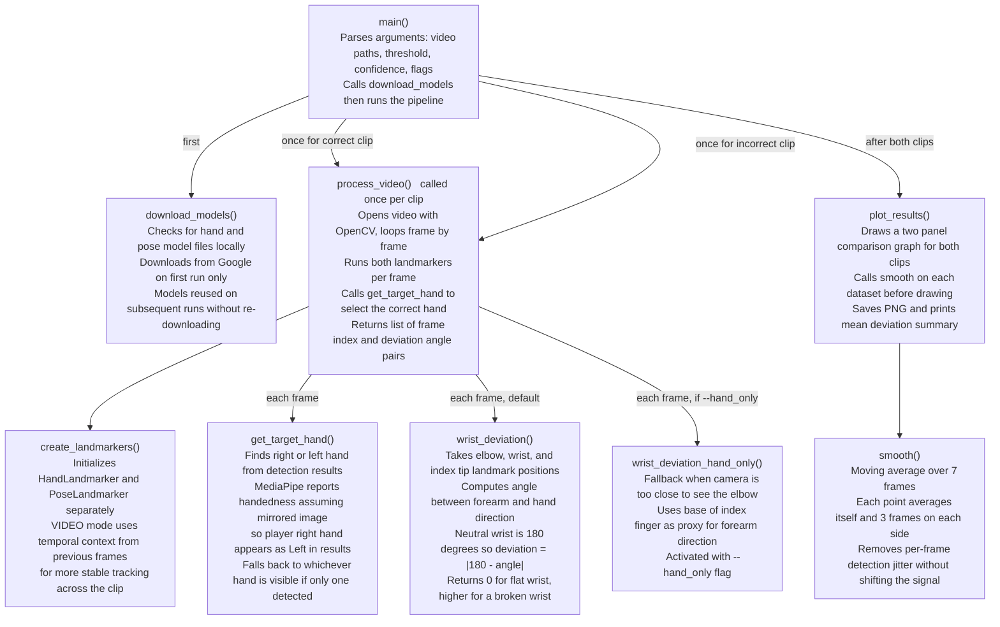
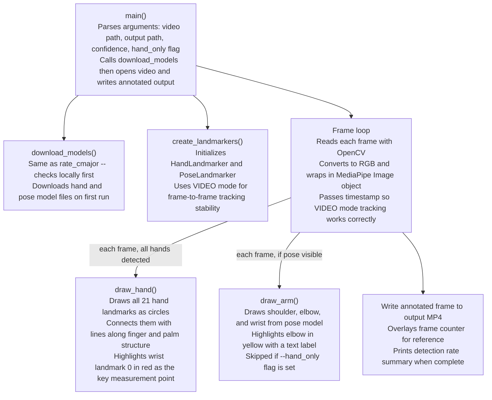

# Music and AI -- System Architecture

## System Architecture Diagram

The system takes a recorded performance video and splits it into two parallel
processing tracks: one for the visual movement, one for the audio. Each track
builds its own baseline from real expert data independently, then the two error
signals are fused into a teaching output. Neither track depends on the other
to generate its baseline.

```mermaid
graph TD

    SRC["Student Performance Video
    Single camera recording of a pianist"]

    SRC -->|video frames| EXTRACT
    SRC -->|audio stream| AUDIO

    subgraph VideoTrack ["Video Track -- current focus"]

        EXTRACT["Hand and Arm Extraction
        Current placeholder: MediaPipe Holistic
        Next: 4DHands -- full 3D hand mesh from monocular video
        Richer geometry than landmark points, handles occlusion between fingers"]

        METRICS["Metric Calculation
        Current: wrist deviation angle per frame
        Expanding to: arm posture, tension markers, finger independence
        Style-aware: Bach technique differs from Chopin at this level"]

        BASELINE["Comparison Against Expert Baseline
        Compare student motion against distribution of real expert performances
        Source: PianoMotion10M -- 116hrs expert video with annotated hand poses
        A learned range of acceptable technique, not a single reference clip"]

        EXTRACT --> METRICS --> BASELINE
    end

    subgraph AudioTrack ["Audio Track -- next phase"]

        AUDIO["Audio Preprocessing
        Separates audio from video
        Normalizes to -12dB and applies low and high pass filters"]

        FEAT["Feature Extraction
        Detects note onsets, pitch, dynamics, and tempo
        Articulation and phrasing characteristics"]

        TRANS["Transcription and Score Comparison
        Audio to MIDI, compare against original score
        Identify implicit expression not written in the score
        Source: MAESTRO -- 200hrs aligned audio and MIDI"]

        AUDIO --> FEAT --> TRANS
    end

    SYNC["Temporal Alignment
    A key press appears in both tracks simultaneously
    Finger velocity drop in video matches note onset in audio
    This physical event locks the two tracks without timecode"]

    BASELINE --> SYNC
    TRANS --> SYNC

    subgraph Fusion ["Fusion Layer -- future phase"]

        LATENT["Shared Feature Space
        Stack physical and musical error vectors per moment
        PCA compresses into axes of maximum variation across both tracks
        Nonlinear encoding and decoding via autoencoder reveals latent structure
        Cross-modal patterns emerge here without being hand-coded"]

        FEEDBACK["Professor Input Layer
        Teacher reviews outputs and adds corrections
        Introduces music theory, phrasing intent, stylistic context
        Narmour variables for melodic expectation and implied continuation
        Model updates from corrections rather than operating as a black box"]

        LATENT --> FEEDBACK
    end

    SYNC --> LATENT

    OUTPUT["Teaching Output
    Technique error report with timestamps
    Musical nuance detected beyond what is written in the score
    Progression path calibrated to the student"]

    FEEDBACK --> OUTPUT

    classDef done    fill:#E1F5EE,stroke:#0F6E56,color:#085041
    classDef active  fill:#FFF8E1,stroke:#F57F17,color:#E65100
    classDef future  fill:#EDE7F6,stroke:#512DA8,color:#311B92
    classDef neutral fill:#F5F5F5,stroke:#424242,color:#212121

    class SRC,OUTPUT neutral
    class EXTRACT,METRICS done
    class BASELINE,AUDIO,FEAT,TRANS active
    class SYNC,LATENT,FEEDBACK future
```

---

## Phase Overview

| Phase | Deliverable | Status |
|-------|-------------|--------|
| 1 | MediaPipe landmark extraction from uploaded video | Done |
| 2 | Wrist deviation scored and plotted vs threshold | Done |
| 3 | Replace MediaPipe with 4DHands for full 3D hand mesh | Next |
| 4 | Compare 4DHands output against PianoMotion10M expert baseline | Next |
| 5 | Audio separated, normalized, onset and pitch extracted | Parallel |
| 6 | Performance transcribed to MIDI and compared to original score | Parallel |
| 7 | Video and audio tracks aligned using finger contact as sync anchor | Future |
| 8 | PCA and autoencoder fusion of physical and musical error signals | Future |
| 9 | Professor input layer, style context, teaching output | Future |

---

## Code Architecture -- rate_cmajor.py

This script is the Phase 2 deliverable. It reads two video files, extracts
wrist deviation angle frame by frame from each, and outputs a comparison plot.
The core math in wrist_deviation stays the same when 4DHands replaces
MediaPipe -- only the extraction layer changes.

---

## Code Architecture -- visualize_landmarks.py

This script applies the landmarks visually onto the input video, allowing the user
to view exactly what the pipeline is tracking to assist in determining if the system
is functioning as expected.

---

## Design Notes

**Uploaded video over real-time** -- processing a recorded clip removes time
pressure and gives access to the full video for segmentation and smoothing.
Real-time feedback is a potential later feature once the pipeline is validated.

**Two independent baselines, not one track generating the other** -- an earlier
design used PianoMotion10M's generative model to predict what expert hands
should look like from audio, then compared student hands against that
prediction. This was rejected because it adds generation error on top of
measurement error. The correct approach treats PianoMotion10M as a dataset
of real expert performances to compare against directly.

**Explicit metrics before ML** -- calculating specific values like wrist angle
gives interpretable output the teacher can verify, creates labeled training
data for the future model, and avoids the model learning wrong patterns from
a small initial dataset.

**Finger contact as sync anchor** -- a key press appears in both tracks
simultaneously as a landmark velocity change in video and a note onset spike
in audio. This lets the two tracks be aligned without needing timecode.

**Physical variables being tracked** -- wrist and arm position and posture,
markers of tension in the hand and forearm, finger independence, and
eventually key contact depth. These expand as the video track matures from
MediaPipe to 4DHands.

**Style context in the metric layer** -- technique assessment is not universal.
Playing Bach correctly means being off the key between notes, with articulate
independent finger movement. Playing Chopin correctly means fluid legato led
by the wrist with the fingers following. The metric layer needs to know which
style context applies before scoring deviation. The professor input layer is
where this context enters the system.

**Latent space and PCA** -- once both tracks are producing feature vectors,
PCA finds the axes of maximum variation across the combined data without
being told what to look for. The first components may correspond to
interpretable qualities like expressive versus mechanical or tense versus
relaxed. A _nonlinear autoencoder_ can capture the same structure where the
relationships are curved rather than linear. The _latent space_ is where
cross-modal correlations like wrist tension affecting tone quality become
visible and actionable.

**Why 4DHands next** -- 4DHands reconstructs a full 3D hand mesh from a
standard monocular camera. PianoMotion10M uses the MANO hand model, the
same representation 4DHands outputs, so the two are directly compatible.

## Next Actions:
* compute power of 4Dhands? improvement in tracking?
* local training (inference) because privacy issues
    * data sent to central server which responds
    * prevents data being shared with RPI server
* add generative to fill in missing data occlusion 
* 2 cameras for mediapipe?
    * use that to train one camera to predict other
    * something new!
    * add skin? rich data set, computer graphics
    * train only on novice, infer certain things, vs expert etc
    * time series predictive model data, physically possible movements/realistically by coupling audio
        * predicting the audio from video or video from audio